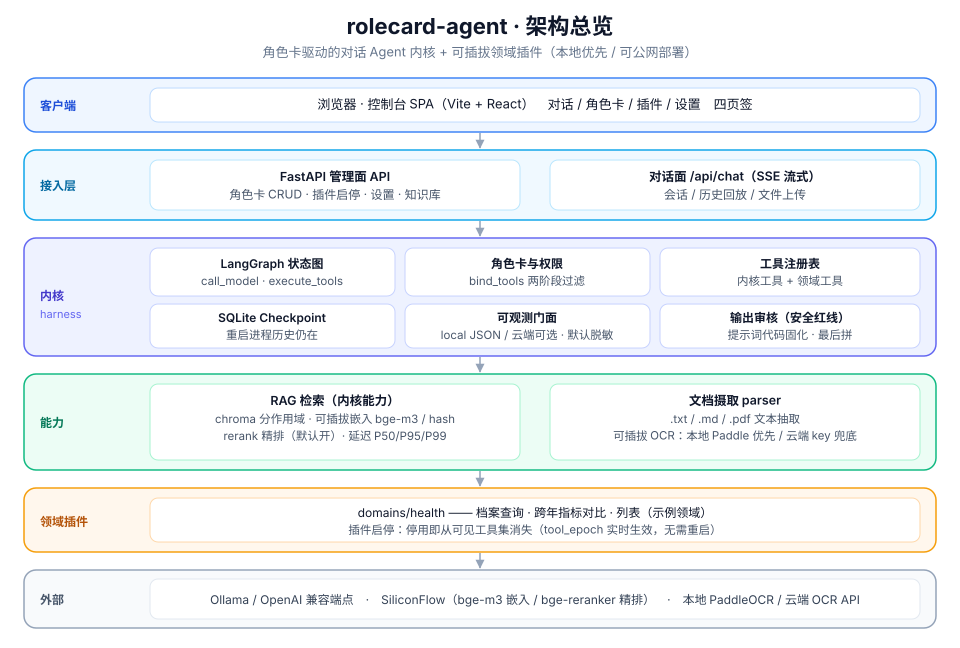
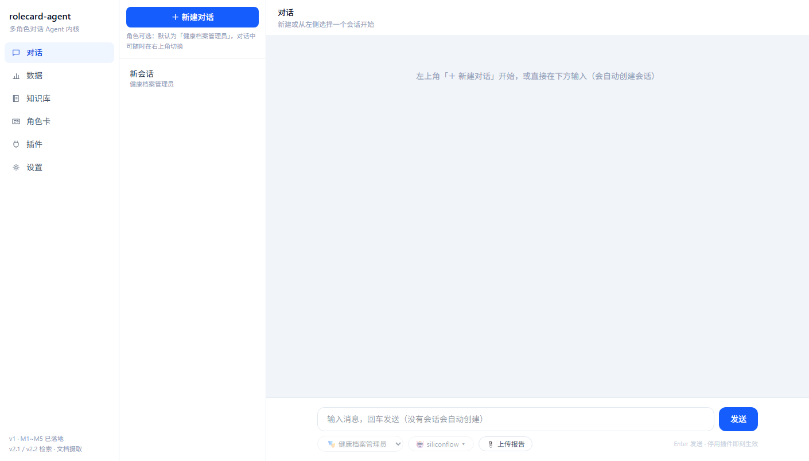
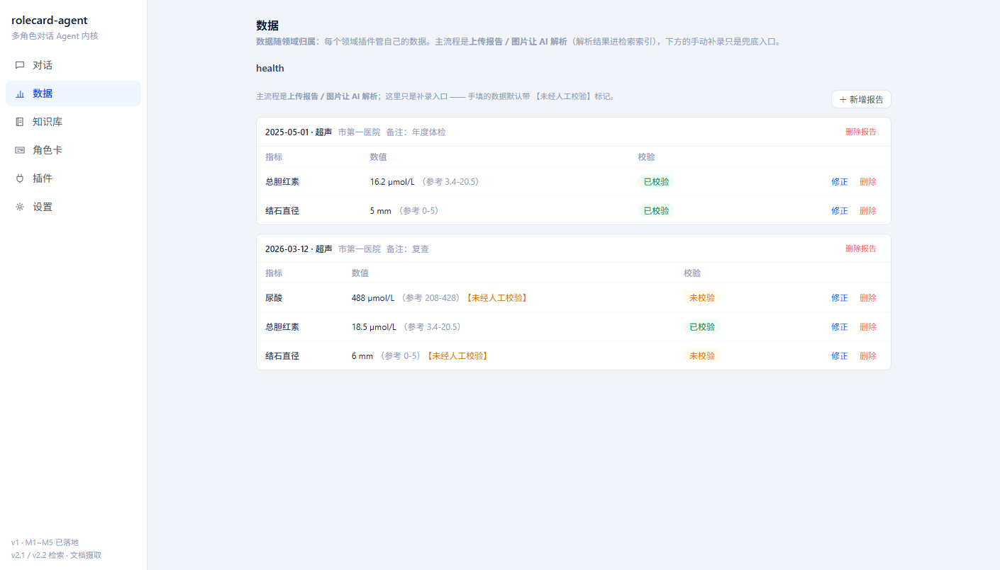
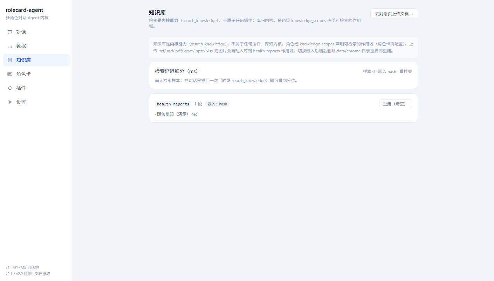
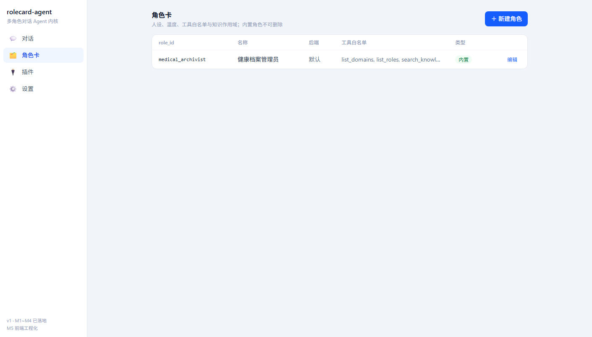
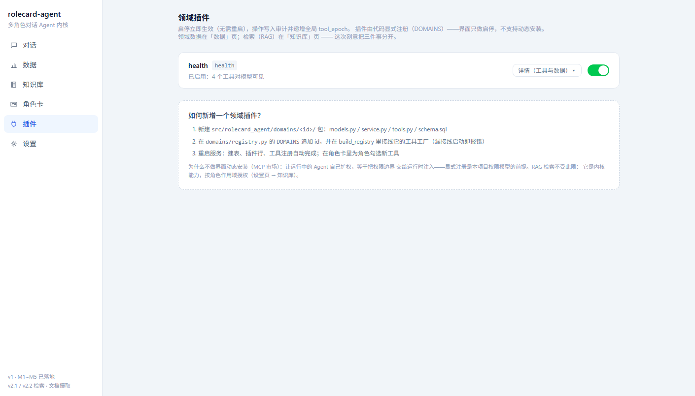
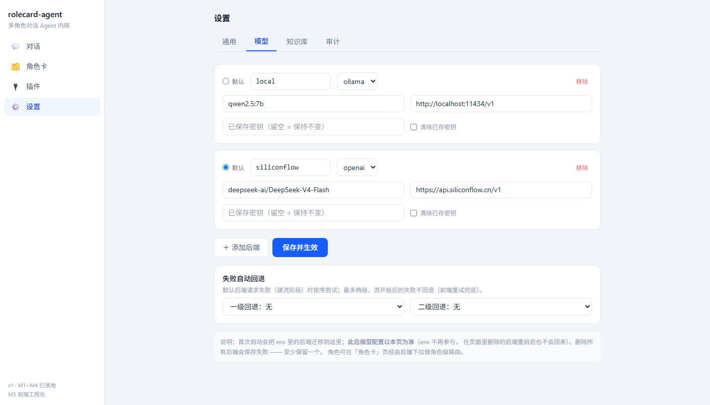

# rolecard-agent

> **角色卡驱动的对话 Agent 内核 + 可插拔领域插件**
> 运行时切换人设与权限，工具与知识检索以插件方式注册，本地优先、可公网部署。

**当前状态：v1 里程碑 M1~M5 全部落地，v2.1 RAG / v2.2 文档摄取 / v2.3 前端工程化全部落地，v2.4 部分落地** ——
内核 / 角色插件 / health 查询工具 / FastAPI 接入层 + SSE 流式对话 / Vite+React 控制台（**六个页签**：
对话 · 数据 · 知识库 · 角色卡 · 插件 · 设置；Hash 路由深链 · 深色模式 · 响应式 · 单页错误边界 ·
**运行环境在线编辑与热生效**）；
**457 个后端测试 + 63 个前端测试全绿、smoke 全部通过、一致性 24 项断言 0 失败、覆盖率 86.77%
（阈值 85%），ruff + mypy 零告警**，且全部离线运行（注入脚本化模型）。
本地模型默认 **`qwen3-vl:8b`（思考 + 识图 + 工具调用一体，8GB 显存可跑）**；云端后端
`siliconflow`（DeepSeek-V4-Flash）保留备用、可随时在界面切换。两轮全项目审查的 P0/P1/P2
**全部修复闭环**（工具循环上界、索引身份稳定、ollama 超时、SSRF、库代际、分层、阻塞……），
剩余事项见「待办与遗留」。

> ⚠️ 评测基线（均值 90.5%~95.2%）是在 **qwen2.5:7b** 上测得的，**该模型已退役**；
> 换用 qwen3-vl:8b 后需重跑 `run_eval.py --runs 3` 取新基线（见 `docs/需求与验收标准.md`）。
> 另：Ollama 官方 vl 版模板不支持工具调用（bind_tools 直接 400），本项目用的是 ModelScope
> GGUF 导入的 qwen3-vl（tools + thinking + vision 三者齐全）。
> 真机 UI 冒烟（`scripts/ui_smoke.js`）需要：服务已启动 + 本机 Chrome/Edge +
> `npm i -D playwright-core`（不下载浏览器）；缺任一条件打印"跳过"并计为通过。
> 单独跑：`node scripts/ui_smoke.js [base_url]`（`UI_SMOKE_HEADLESS=0` 可看窗口）。
**默认角色「通用助手」＝纯对话**（不接工具与档案）；要查档案时切换到「健康档案管理员」。
待续：**v2.4 公网部署**（功能面已部分落地，见上）。

> 上面这组数字**实测于 2026-09-17**（`ruff check .` / `mypy` / `pytest --cov` /
> `scripts/check_consistency.py` / `scripts/smoke_check.py`）。它们是"当时为真"，不是永久承诺 ——
> CI 每次 push 都会重跑并以此为准。

### 第三轮全项目审查（2026-09-17）与两轮修复清单

第三轮审查（`docs/全项目审查报告（2026-09-17）.md`）共 P0×3 / P1×14 / P2 20+，**已全部修复闭环**，
三条 P0 都在正常使用路径上：**工具循环无上界**（+`AGENT_MAX_STEPS` 上限）、**向量索引以原始文件名
为键**（同名互覆盖、静默丢索引，改指摄入任务身份）、**ollama 超时被静默丢弃**（挂起即拖停服务）。
其余代表：删除报告连向量一起清、web_fetch 逐跳 SSRF 校验、前端超时分层（300s）、库代际回滚、
路由直写 SQL 收拢 DomainDataService、sync 阻塞换线程池、base_url scheme 校验、`core/` 清 health 词
（机器断言）等。**事后第二场补充审查（26 项，H4/H5/M1-M10/L 系列）同样全部完成**，
仅用户接受的暂缓项保留：🔒 鉴权默认 off / api_key 明文落盘 / OCR 云端复用 base_url（自用与
友人使用，用户明确接受）。

### 第二轮的六条安全 / 健壮性修复（2026-09-16）

第二轮全量审查做了九个方面的修复，其中三条是**可被利用的边界失效**（审查文档已随修复归档移除，修复记录保留在此）：

1. **域写工具的路径边界** —— `upload_medical_report(file_path)` 的入参来自模型（因而也来自上传文档
   里的提示注入），此前只判断 `p.is_file()`：实测传入 `C:/Windows/win.ini`、`~/.workbuddy/SOUL.md`
   都能登记成功，再经抽取端点被读成文本送给模型。现在路径必须落在 `UPLOAD_DIR` 内。
2. **`AUTH_MODE=auto` 的来源判定** —— 此前无条件采信 `X-Forwarded-For` 的链首作为客户端 IP，
   于是一行请求头就能冒充回环：实测无凭证 401 → 加 `-H 'X-Forwarded-For: 127.0.0.1'` 200。
   现在 `auto` 只认 **TCP 对端地址**；反代场景改用 `AUTH_TRUSTED_PROXIES` 显式声明可信网段。
3. **上下文预算** —— `state["messages"]` 只增不减，而它被全量拼进 prompt：轮次无上限意味着
   几十轮后必然超窗，用户只看到"模型调用失败"。现在按 `CONTEXT_MAX_CHARS` 裁剪，
   **且截断点绝不会落在 ToolMessage 上**（切断 tool_calls 配对会被供应商判为非法序列）。

另外六项：工具执行总时长上限（`TOOL_TIMEOUT_SECONDS`，修"挂住的工具拖垮整个服务"）、
**重试只对显式声明幂等的只读工具开放**（修"写工具被重试 → 多一条副作用"）、
索引幂等重建改为"先嵌入再动库"（修"嵌入失败反而把已有索引删掉"）、
嵌入分批 + 重试、角色 CRUD 补审计、角色引用的模型后端在写时校验。

### 第二轮修复的其余部分

- **XML 实体加固（不引第三方库）**：OOXML 部件在解析**之前**拒绝含 `<!DOCTYPE` / `<!ENTITY`
  的输入，且扫全量而非只看开头。billion laughs / XXE 三类攻击都必须先声明 DTD，
  因此在攻击发生前就结束；合法 OOXML 永不含 DTD，零误伤。
- **上下文裁剪对用户可见**：模型这轮只看到最近 N 条历史时，界面会说明"早期对话已折叠，
  对话记录本身没有丢失"。刷新页面也看得到（事实存在 checkpoint 里，`GET /api/session/{id}/context` 可查）。
- **上传目录回收**：知识库页新增"检查可回收文件 → 确认回收"（先只读盘点、二次确认、
  写审计）。只删**没有任何登记任务引用**的文件，`.parsed.txt` 跟随主文件。
- **前端测试从 12 条到 49 条**：SSE 帧切分与事件归约、上传三态文案抽成纯函数逐条断言，
  另加 5 条真实渲染 ChatPage 的接线测试（jsdom + Testing Library，lockfile 已更新）。
- **评测可复现**：`run_eval.py` 默认 `--runs 3` 做跨遍聚合（单次通过率在 7B 上是抽签——
  实测相邻两遍出现过 7/7 与 4/7），报告自描述（模型 / 评测集指纹 / 通过率区间 / 逐用例稳定率），
  `--strict` 按**均值**卡 85% 回归线。本机实测：均值 66.7% → **90.5%~95.2%**
  （修角色提示词的工具路由 + 一处过度限定的用例断言）。
- **评测报告自描述**：`run_eval.py` 的报告带上 `provider` / `model` / `case_set_hash` /
  `pass_rate`，`--strict` 除用例全过外还要求达到 `--min-pass-rate`（默认 0.85）。
  通过率离开上下文不是一个可解读的数字。


### 结构化抽取（报告 → 指标行）怎么保证不出错

上传报告后自动走一条**三层校验**管线，再写入档案：

1. **schema 约束抽取** —— 强类型 JSON，缺失必须 `null`（不许编），每项必须给出**原文片段**；
2. **确定性校验**（零成本）—— 数值可解析、日期合理、单位长度、与历史值差异是否突变；
3. **原文锚定** —— 抽出的值必须在原文里找得到出处，找不到判为疑似幻觉直接拒收；
4. **第二模型交叉验证** —— 换一个 provider 的后端独立再抽一遍逐字段比对（行业里叫
   LLM-as-verifier，有现成产品先例）；只有一个后端时降级为同模型复查，并**如实标注为弱校对**。

写入铁律：**只有两个模型都一致的项才入库**，其余进「待确认」由人裁决；一律标记
【未经人工校验】；同一份文件幂等，绝不覆盖人工已校验的数据。
抽取用哪个模型默认**本地优先**（`EXTRACT_BACKEND=auto`，报告不出本机），可配置切换。

---

## 架构总览



<sub>分层：客户端 → 接入层 → 内核 harness → 能力（RAG 检索 / 文档摄取）→ 领域插件 → 外部依赖。
核心约束：`core/` 内不出现 `health`（分层解耦，`check_consistency` 可机器校验）；**检索是内核能力**，
领域只声明作用域；OCR 走可插拔后端，本地 Paddle 优先、云端 key 兜底。</sub>

---

## 界面预览

控制台（Vite + React，`npm run build` 产物由 FastAPI 托管）六个页签 —— 刻意把最易混淆的三件事分开：
**数据**（领域数据，随域归属）· **知识库**（RAG 检索，内核能力）· **插件**（能力开关）。

| 对话 | 数据（领域数据，可补录） | 知识库（RAG + 检索延迟） |
| --- | --- | --- |
|  |  |  |

| 角色卡（含范例 exemplars） | 插件（纯能力开关） | 设置（模型热切换 + 回退链） |
| --- | --- | --- |
|  |  |  |

---

## 快速开始

```bash
# 1. 环境（.venv + pip，Python ≥ 3.13）
python -m venv .venv
.\.venv\Scripts\python.exe -m pip install -U pip

# 2. 依赖（按范围镜像安装；OCR 依赖必须独立 venv，勿装进 .venv）
.\.venv\Scripts\python.exe -m pip install -r requirements.txt -r requirements-dev.txt \
    -r requirements-api.txt -r requirements-rag.txt
#    （-rag 必须装：知识库 / 上传解析 / 检索都依赖 chromadb+pypdf，漏装会 ImportError）

# 3. 本地模型（.env 里默认后端 local 指向 Ollama）
#    qwen3-vl:8b = 对话 + 工具调用 + 识图 + 思考（ModelScope GGUF 导入，见下方说明）
ollama pull qwen3-vl:8b

# 4. 配置
copy .env.example .env

# 5. 建表 + 初始化内置角色
python scripts/init_db.py

# 6. 一致性自检（文档与代码是否同步，退出码可用于 CI）
python scripts/check_consistency.py

# 7. 启动控制台（管理面 + 流式对话）
uvicorn --factory rolecard_agent.api.main:create_app --port 8000
# 浏览器打开 http://127.0.0.1:8000/ ：新建会话 → 对话（SSE 流式）→ 页面切角色 → 启停插件
# 没跑本地模型也能演示：按 scripts/smoke_chat.py 的说明配一个 OpenAI 兼容端点即可
# （或在设置页直接添加后端，保存即热生效）

# 8.（可选）改动前端后重新构建 —— dist 已提交，普通演示不需要 node
cd frontend && npm install && npm run build
```

## 部署

```bash
# Docker（dist 已入库，镜像里没有 node）
docker build -t rolecard-agent .
docker run -p 8000:8000 -v rolecard-data:/app/data rolecard-agent

# CI：push 即跑（GitHub Actions）—— ruff + mypy + 全量离线测试（覆盖率阈值 85%）+
#     一致性核查 + 前端 vitest / tsc / build
# 依赖安装：CI 与 Docker 实际使用 requirements*.txt（无上界 pin，镜像自 pyproject.toml，
# 由 check_consistency.py 的 dependency parity 断言保证同步）。仓库无 uv.lock ——
# 依赖管理统一为 .venv + pip（见 CONTRIBUTING.md 第 8 节）。
# （内核 + dev + api + rag —— 漏装 rag 会让知识库/解析测试直接 ImportError）
```

> v2 才需要的依赖单独安装：`requirements-rag.txt`（检索，v2.1）、`requirements-ocr.txt`
>（OCR，**必须独立 venv**，v2.2，切勿与主服务共用环境）。HTTP 接口依赖
> `requirements-api.txt` 属于 **v1 M4**，已在上面第 2 步装好；接入云端模型另装
> `requirements-cloud.txt`（代码零改动，只改 `MODEL_BACKENDS`）。
>
> 「3 条命令能跑起来」是 `docs/实施计划.md` P4 的出口条件 —— 这份 README 必须能兑现它。

---

## 一、定位

| 层次 | 内容 | 说明 |
| --- | --- | --- |
| **核心主体** | 对话 Agent 内核：状态图编排、Prompt 装配、工具供给、会话持久化、权限管控、可观测 | 项目的主叙事 |
| **扩展机制** | 插件注册表：领域插件可启用/停用，工具与数据自动装配进内核 | 讲扩展性与解耦 |
| **外挂能力** | 知识库检索（RAG）：作为可注册工具挂载，不绑定任何领域 | |
| **示例领域** | `domains/health` 健康档案（结构化查询 + 文档报告检索） | 证明内核可扩展，不是项目主题 |

**自证分层的一条硬规则**：`src/rolecard_agent/core/` 内**不出现任何 `health` 字样**。

---

## 二、架构

```
                       ┌──────────────────────────────┐
  接入层               │  FastAPI  ·  CLI  ·  前端      │
                       └──────────────┬───────────────┘
                                      │
                       ┌──────────────▼───────────────┐
  内核 core/           │  状态图编排 StateGraph         │
  （与领域无关）        │  Prompt 装配（安全规则固化后置）│
                       │  工具注册表 · 按角色 bind_tools│
                       │  Checkpointer · 可观测门面     │
                       └──────────────┬───────────────┘
                                      │ 工具调用（Pydantic 强类型）
                       ┌──────────────▼───────────────┐
  插件层               │  domains/  显式注册，可启停     │
                       │   └─ health  档案 · 指标 · 报告 │
                       │  roles/    角色卡 + 白名单      │
                       │  rag/      知识库检索 · 文档摄取 │
                       └──────────────┬───────────────┘
                                      │
                       ┌──────────────▼───────────────┐
  存储层               │  SQLite 结构化  ·  Chroma 向量 │
                       └──────────────────────────────┘
```

**两阶段工具过滤**：先按**已启用插件**收窄工具池，再按**当前角色白名单**收窄，最后才 `bind_tools` —— 模型从来看不到它无权调用的工具。

---

## 三、目录结构

```
rolecard-agent/
├── src/rolecard_agent/
│   ├── config.py                  # 环境驱动配置（模型 provider / 存储 / 认证 / 可观测后端）
│   ├── core/                      # ★ Agent 内核，与领域无关
│   │   ├── state.py  prompts.py  nodes.py  graph.py
│   │   ├── checkpointer.py        #   会话持久化（SQLite）
│   │   ├── observability.py       #   可观测门面，默认键控脱敏
│   │   ├── ingestion.py           #   摄取台账（file_hash 幂等 + 状态机）
│   │   ├── model_settings.py      #   模型后端 CRUD（key 只写不回读）+ 热重建数据层
│   │   ├── runtime_settings.py    #   运行环境覆盖（env 之上叠加，保存即热生效）
│   │   ├── domain_data.py         #   通用领域数据服务（路由不直写 SQL）
│   │   ├── consensus.py           #   多模型比对内核工具 compare_model_answers
│   │   ├── probes.py              #   视觉/OCR 后端可用性探测原语
│   │   ├── plugins.py  guard.py  tools/
│   ├── roles/                     # 角色卡 CRUD + 白名单 + 内置/域种子
│   ├── domains/                   # ★ 插件层
│   │   ├── registry.py            #   显式插件清单（无动态加载）
│   │   └── health/                #   示例领域插件（含三层校验抽取 extract.py）
│   ├── rag/                       # 检索：parser（txt/pdf/OOXML）/ ocr（可插拔）/ retriever
│   ├── storage/                   # SQLite（ThreadLocalConnection）/ bootstrap
│   └── api/                       # 接入层：main（装配）+ 认证 + 依赖注入 + 路由（routers/）
├── frontend/                      # React 18 + Vite 控制台（6 页签；dist 有意入库）
├── docs/   tests/   scripts/   data/
```

---

## 四、技术栈

| 组件 | 版本 | 说明 |
| --- | --- | --- |
| Python | >=3.13 | **实测基线**：3.13.14 上 v1 与 chromadb 实际装通并跑过测试；OCR 链路的依赖在 3.13 上为 pure-python / cp313 / abi3 全覆盖 |
| langgraph | 1.2.11 | 与 langchain 1.4.0 的 `>=1.2.11,<1.3.0` 约束对齐 |
| langchain | 1.4.0 | |
| langchain-ollama | >=1.1.0 | 模型接入走 `init_chat_model`，本地 / API key 可切换 |
| langgraph-checkpoint-sqlite | — | 会话持久化 |
| chromadb | >=1.5.9 | 向量检索 |
| pydantic | >=2.13 | 跨层强类型 |
| fastapi / uvicorn | v1 · M4 | 最小接入层，依赖在 `requirements-api.txt` |
| React + Vite + TypeScript | v1 · M5 | 控制台前端（`frontend/` 子项目），构建产物 `frontend/dist` 由 FastAPI 托管 |

> **依赖按范围拆分，不要把 v2 的包装进 v1 环境**：
> `requirements.txt`（v1 内核）/ `-dev`（测试工具）/ `-api`（接入层）/ `-rag`（chromadb）/ `-ocr`（paddle，独立 venv）。
> 唯一事实来源是 `pyproject.toml`。版本修正依据见 `docs/技术评审与决策.md`。

---

## 五、版本规划

按开发生命周期推进，v1 保留五个里程碑（M5 为前端工程化，自 v2.3 提前），其余进 v2 roadmap。
完整计划见 `docs/实施计划.md`，需求与验收标准见 `docs/需求与验收标准.md`。

### v1 · 当前目标

| 里程碑 | 内容 | 验收标准 |
| --- | --- | --- |
| **M1 内核** | 状态图、Prompt 装配、按角色 `bind_tools`、SQLite 检查点、可观测门面、工具注册表 | 同一 `thread_id` 切换角色 → 人设立刻变、历史不丢；**重启进程历史仍在**；被禁工具在模型侧**完全不可见** |
| **M2 角色与插件** | 角色卡 CRUD（含 `exemplars` / `knowledge_scopes`）、插件启停（`tool_epoch` 实时生效）、两阶段工具过滤、审计、云端后端可选 | 停用插件后其工具从可见集消失且**无需重启**（`tool_epoch` 每轮实时读取）；内置角色不可删；`ingestion_task` 独立状态机 + `file_hash` 幂等 |
| **M3 领域插件** | `domains/health` 档案 CRUD + 查询 / 对比 / 列表工具 | 自然语言提问触发正确工具；跨年对比出结果；未校验指标带标记 |
| **M4 接入层与演示界面** | 最小 FastAPI（chat SSE / 角色 CRUD / 插件启停）+ 单页聊天 UI | 浏览器里能对话并流式输出；页面切换角色历史不丢；停用插件后立刻看到工具消失；**能录出 60 秒演示视频** |
| **M5 控制台前端工程化** | `frontend/`（Vite + React + TS）六页签：对话（历史会话续聊）/ 数据 / 知识库 / 角色卡 / 插件 / 设置（自定义模型热切换） | 六页签可用；点击历史会话能续聊；设置页保存新后端后下一轮对话即生效（**无需重启**）；`npm run build` 产物由 FastAPI 托管 |

v1 同时包含：**测试与评测集（含通过率基线）**、Docker、GitHub Actions、README、60 秒演示视频（按用户决策取消录制）。

### v2 · roadmap（暂不实现）

| 版本 | 内容 |
| --- | --- |
| v2.1 | 检索外挂 RAG —— **已落地**：chroma 分作用域集合、可插拔嵌入（bge-m3 / hash 离线兜底）、`search_knowledge` 内核工具（作用域由角色声明、内核注入）、上传直接入库、**rerank 默认开启**、**检索延迟 P50/P95/P99 细分** |
| v2.2 | 文档摄取 —— **已落地**：`.txt/.md/.pdf` 解析 + **Office OOXML（`.docx/.pptx/.xlsx`，标准库 zip+XML，零新依赖）** + **可插拔 OCR（本地 Paddle 优先 / 云端 API key 兜底）** + **结构化抽取（报告文本 → 指标行：schema 约束 + 确定性校验 + 原文锚定 + 第二模型交叉验证）** |
| v2.3 | 完整前端 —— **已落地**：组件库 / 响应式 / 深色模式 / Hash 路由深链 / 错误边界 / 导航预加载（多页应用已提前为 M5） |
| v2.4 | 公网部署与多后端路由 —— **部分落地**：联网总闸 + 域名白名单、思考总开关、consensus 多模型比对、运行环境在线编辑与热生效、模型失败自动回退；**公网部署待做** |
| v2.5 | 生产化替换（Postgres / Milvus / Redis） |

> 取舍理由见 `docs/技术评审与决策.md`：**规划得越完整越容易做不完，而做不完的项目在简历上是零。**
> README 里有一份清晰的 roadmap 是加分项；一个半成品项目是减分项。

---

## 六、部署形态

设计目标：**同一份代码，离线可用，也能公网跑。**

| 场景 | 模型 | 可观测 | 存储 |
| --- | --- | --- | --- |
| 本地离线 | Ollama（qwen3-vl:8b） | 本地 JSON 日志（默认，键控脱敏） | 本地 SQLite + Chroma |
| 公网 Demo | Ollama，或任意 OpenAI 兼容 API（填 base_url + key） | 本地 JSON 日志 / 审计表（langsmith 依赖已删，2026-09-17） | 挂载卷 |

模型接入统一走 `init_chat_model`，provider 由配置决定，不改业务代码。
文档解析（OCR）依赖较重，计划独立进程 / 独立容器，与主服务解耦。

---

## 七、插件开发约定

新增一个领域插件只需三步，**没有动态加载、没有发现机制**：

1. 在 `domains/<name>/` 实现 `models.py` / `service.py` / `tools.py` / `schema.sql`
2. 在 `domains/registry.py` 的 `DOMAINS` 列表追加一行
3. 初始化数据库时装载该域的 `schema.sql`

启停在管理侧完成（写 `plugin` 表 + 重建图），**不暴露为 LLM 可调用的工具**。

---

## 八、文档索引

| 文件 | 内容 |
| --- | --- |
| `docs/需求与验收标准.md` | PRD、用户故事、成功标准、评测集设计、v1/v2 边界（**需求层面的唯一来源**） |
| `docs/实施计划.md` | **当前生效的执行计划**：生命周期六阶段 + 出口条件 + 部署拓扑 + 多后端共存 |
| `docs/技术评审与决策.md` | 依赖版本冲突、设计缺陷、已知风险、历年核查条目、**已定决策记录** |
| `docs/UI设计与信息架构（修订）.md` | 六页签 IA 的功能覆盖度审计与修订计划（S1~S5 全部完成） |
| `docs/前端架构设计（S4）.md` | 组件库 / 响应式 / 深色模式的前端架构设计（已落地，保留为设计记录） |
| `docs/本地多模态模型部署评估.md` | 本机硬件评估 + 本地多模态模型选型（现用 **qwen3-vl:8b**，一行多用；qwen2.5vl:7b 已退役） |
| `docs/设计对标.md` | 设计决策 ↔ 业界实践映射（对齐 / 取舍 / 缺口），面试"为什么这么设计"的口径 |
| `docs/面试问答清单.md` | 面试口述材料（随开发进度填充） |
| `CONTRIBUTING.md` | 协作规约：铁律、不可改清单、接口契约、错误码、评测用例格式、环境准备 |

> 文件名不再带序号 —— 序号会随文件合并/新增而过期，语义命名不会。
> 文档内的 `D*` / `C*` / `A*` / `R*` / `E*` 都是 `技术评审与决策.md` 的内部条目编号。
>
> 最初的原始方案已于 2026-09-14 移除（备份在仓库之外）：它包含大量已被推翻的结论（旧版本号、
> 未核实的厂商名单、已被取代的排期），而**其中每一条更正都已收录在 `技术评审与决策.md`** ——
> 所以删除它不损失信息。

---

## 九、免责声明

本项目为技术学习与工程实践作品，演示数据全部虚构。
系统设计上禁止输出任何疾病诊断、用药建议或治疗方案，仅对已入库档案数据做汇总与查询。
AI 自动提取的指标默认标记为「未经人工校验」，不构成任何医疗建议。
